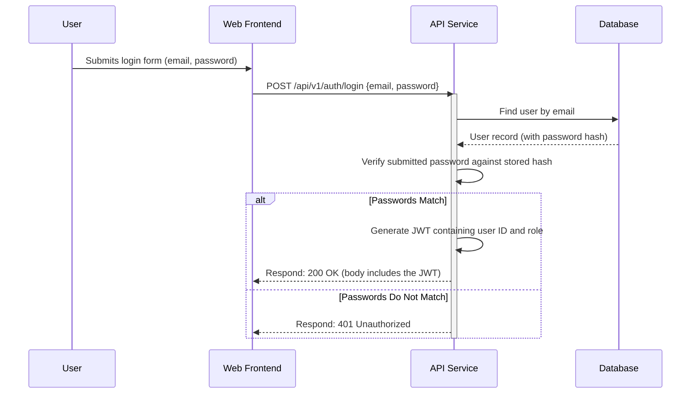

# 11. Backend Architecture

### Service Architecture

As we've chosen a traditional server model with Spring Boot, our architecture will be based on the standard Controller-Service-Repository pattern.

#### Controller/Route Organization

We will organize our REST controllers by feature or domain, which mirrors the structure of our frontend and API specification. This keeps related endpoints grouped together and makes the codebase easy to navigate.

```java
// In package com.recruitify.
└── controller/
    ├── AuthController.java       # Handles POST /api/v1/auth/register, /login
    ├── ProfileController.java    # Handles GET /api/v1/profile, POST/PUT /profile/work-experience
    ├── JobController.java        # Handles all endpoints under /api/v1/jobs
    └── ... (other controllers as features are added)
```

Each controller will be responsible for handling HTTP requests for a specific resource, validating the input, and delegating the business logic to a corresponding `Service` class.

### Database Architecture

#### Schema Design

The database schema will be based on the SQL script we defined previously in the "Database Schema" section. That script is the single source of truth for our table structures, relationships, and constraints.

#### Data Access Layer (DAL)

We will use the **Repository Pattern** to abstract all database interactions. This pattern will be implemented using **Spring Data JPA**.

For each of our data models (e.g., `User`, `UserProfile`), we will create a corresponding repository interface that extends Spring's `JpaRepository`. Spring Data JPA will then automatically provide a complete implementation for all standard CRUD (Create, Read, Update, Delete) operations at runtime. This drastically reduces the amount of boilerplate code we need to write.

Custom queries can be easily added by defining new method signatures in the interface.

**Repository Example:**

```java
// In package com.recruitify.repository
import org.springframework.data.jpa.repository.JpaRepository;
import java.util.Optional;
import java.util.UUID;

// The User entity and its primary key type (UUID) are specified
public interface UserRepository extends JpaRepository<User, UUID> {

    // Spring Data JPA will automatically implement this method
    // to find a user by their email address.
    Optional<User> findByEmail(String email);
}
```

### Authentication and Authorization

We will use **Spring Security** to secure our backend API. Since our API is stateless (a key principle of REST), we will use **JSON Web Tokens (JWT)** for authentication.

#### Authentication Flow (Login)

This diagram illustrates how a user logs in and receives a JWT.



#### Authorization Filter (Middleware)

To protect our endpoints (e.g., `GET /profile`), we will implement a custom `JwtAuthorizationFilter` within the Spring Security filter chain.

1.  For every incoming request to a protected endpoint, this filter will execute.
2.  It will look for an `Authorization` header with a `Bearer <token>` value.
3.  It will validate the JWT's signature, claims, and expiration date.
4.  If the token is valid, the filter will extract the user's identity, set up the Spring Security context, and allow the request to proceed to the controller.
5.  If the token is missing, invalid, or expired, the filter will immediately reject the request with a `401 Unauthorized` status.

---

