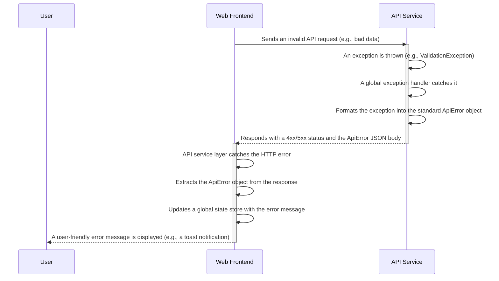

# 18. Error Handling Strategy

### Error Response Format

To ensure consistency, all errors returned by the backend API will follow a standardized JSON format. This allows the frontend to reliably parse and handle any error.

```typescript
// This interface will be defined in packages/shared-types
export interface ApiError {
  error: {
    code: string;          // A machine-readable error code (e.g., 'VALIDATION_ERROR')
    message: string;       // A developer-friendly error message
    details?: Record<string, any>; // Optional field for extra info (e.g., validation failures)
    timestamp: string;     // ISO 8601 timestamp of when the error occurred
  };
}
```

### Error Flow

This diagram shows how an error propagates from the backend to the frontend.



---

