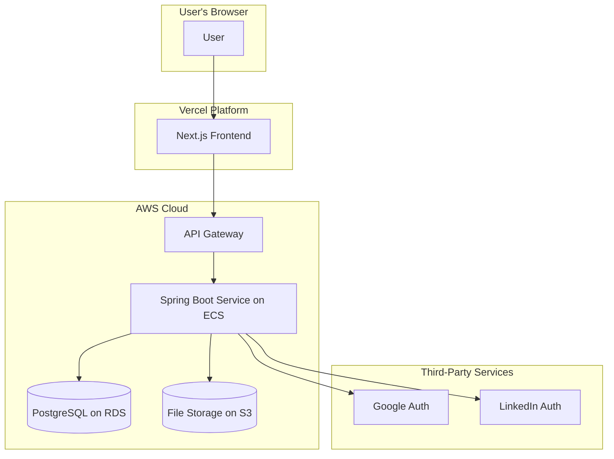

# 2. High Level Architecture

### Technical Summary

The proposed architecture for Recruitify is a modern, decoupled full-stack application. The frontend will be a **Next.js** application deployed on **Vercel**, leveraging its edge network for optimal performance and a Jamstack-style approach. The backend will be a **Spring Boot monolith**, containerized and running on **AWS**, which provides a robust and scalable environment. The two will communicate via a REST API, with an API Gateway acting as the single entry point for security and management. This architecture directly supports the PRD's goals of creating a fast, reliable, and secure platform that can be developed efficiently.

### Platform and Infrastructure Choice

*   **Platform:** A hybrid approach using **Vercel** for the frontend and **Amazon Web Services (AWS)** for the backend.
*   **Key Services:**
    *   **Vercel:** Next.js Hosting, Edge CDN, CI/CD for frontend.
    *   **AWS:**
        *   Amazon ECS (or Fargate) for running the containerized Spring Boot application.
        *   Amazon RDS for a managed PostgreSQL database.
        *   Amazon S3 for user file storage (e.g., profile pictures, resumes).
        *   Amazon API Gateway for managing the REST API.
*   **Deployment Host and Regions:** Vercel (Global Edge Network), AWS (e.g., us-east-1).

### Repository Structure

*   **Structure:** **Monorepo**, as specified in the PRD, to streamline development and code sharing.
*   **Monorepo Tool:** **Turborepo**. It offers high-speed builds, intelligent caching, and integrates seamlessly with Vercel.
*   **Package Organization:**
    *   `apps/web`: The Next.js frontend application.
    *   `apps/api`: The Spring Boot backend application.
    *   `packages/shared-types`: For sharing TypeScript types (e.g., API request/response models) between frontend and backend.

### High Level Architecture Diagram

### Architectural Patterns

*   **Jamstack (Frontend):** The frontend will be pre-rendered where possible and served from a global CDN, with dynamic features powered by APIs.
    *   *Rationale:* This provides maximum performance, scalability, and security for the user-facing application.
*   **Monolithic Service (Backend):** The backend will be a single, cohesive Spring Boot application.
    *   *Rationale:* For an MVP, a monolith is simpler to develop, deploy, and maintain than a microservices architecture.
*   **API Gateway:** All API requests from the frontend will pass through a central API Gateway.
    *   *Rationale:* This provides a single point for handling authentication, rate limiting, and routing, simplifying the backend service.
*   **Repository Pattern (Backend):** Data access logic will be abstracted into a repository layer.
    *   *Rationale:* This decouples the business logic from the database, making the code easier to test and maintain.

---

