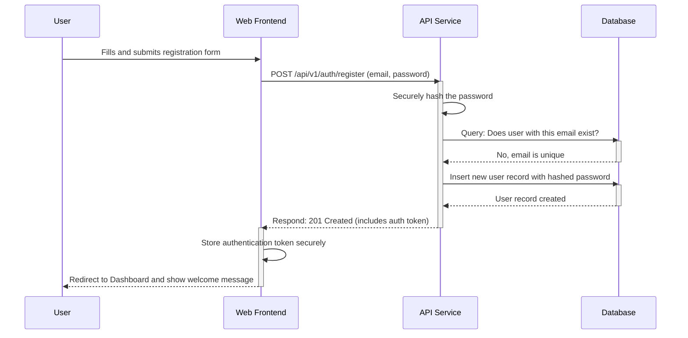

# 8. Core Workflows

### Workflow: New User Registration

This diagram shows the sequence of events when a new user signs up for Recruitify using their email and password.

```mermaid
sequenceDiagram
    participant U as User
    participant FE as Web Frontend
    participant BE as API Service
    participant DB as Database

    U->>FE: Fills and submits registration form
    FE->>BE: POST /api/v1/auth/register (email, password)
    activate BE
    BE->>BE: Securely hash the password
    BE->>DB: Query: Does user with this email exist?
    activate DB
    DB-->>BE: No, email is unique
    deactivate DB
    BE->>DB: Insert new user record with hashed password
    activate DB
    DB-->>BE: User record created
    deactivate DB
    BE-->>FE: Respond: 201 Created (includes auth token)
    deactivate BE
    activate FE
    FE->>FE: Store authentication token securely
    FE-->>U: Redirect to Dashboard and show welcome message
    deactivate FE
```

---

