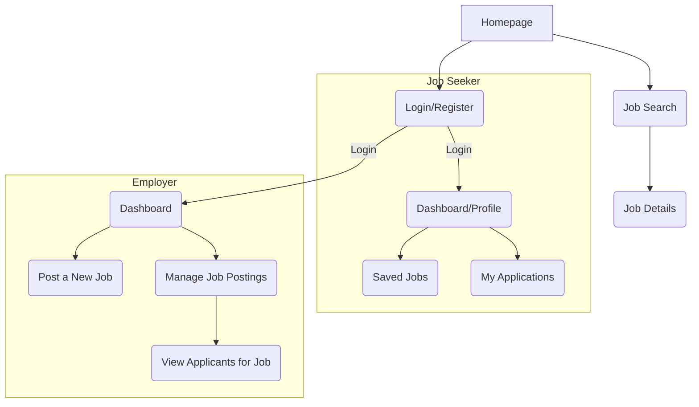
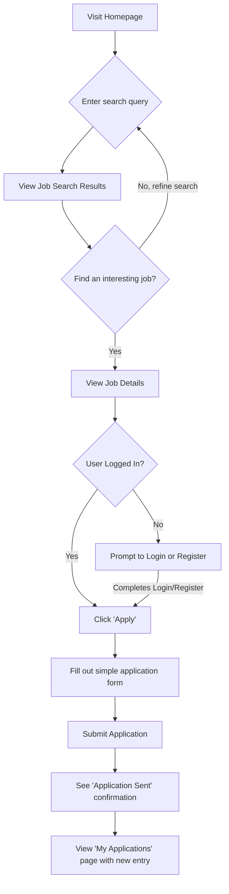
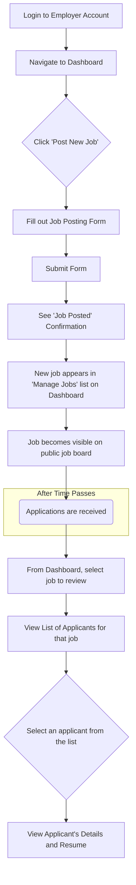

# Recruitify UI/UX Specification

## **Introduction**

This document defines the user experience goals, information architecture, user flows, and visual design specifications for Recruitify's user interface. It serves as the foundation for visual design and frontend development, ensuring a cohesive and user-centered experience.

**Overall UX Goals & Principles**

**Target User Personas**

- **Job Seeker:** Students, recent graduates, and professionals who need a simple, efficient way to search for relevant jobs, manage applications, and track their progress. They value clarity and ease of use.
- **Employer/HR:** Individuals or teams at small to medium-sized businesses who need a straightforward tool to post job listings, manage them, and review incoming applicants without unnecessary complexity.

**Usability Goals**

- **Ease of Learning:** A first-time user should be able to successfully search for and apply to a job in under 5 minutes.
- **Efficiency:** An employer should be able to post a new job in under 3 minutes.
- **Clarity:** Users should always feel confident about where they are in the application and what the next step is.

**Design Principles**

1.  **Clarity First:** Prioritize clear, unambiguous language and visuals over clever or trendy design.
2.  **Effortless Flow:** Design workflows that feel intuitive and remove as many steps as possible from core tasks like applying or posting a job.
3.  **Progressive Disclosure:** Show only the information and actions needed for the current step to avoid overwhelming the user.
4.  **Trustworthy & Professional:** The design must inspire confidence and feel like a reliable, professional platform.

**Change Log**

| Date       | Version | Description                 | Author     |
| :--------- | :------ | :-------------------------- | :--------- |
| 2025-09-23 | 1.0     | Initial draft based on PRD. | Sally (UX) |

---

## **Information Architecture (IA)**

**Site Map / Screen Inventory**

This diagram shows the primary screens of the application and their relationships.

**Navigation Structure**

- **Main Navigation (Public/Logged-Out Users):**
  - A primary navigation bar will contain links to: `Jobs`, `For Employers`, `Login`, and a `Register` call-to-action.
- **Main Navigation (Job Seeker):**
  - After logging in, the navigation will change to: `Jobs`, `My Applications`, `Saved Jobs`, and a user menu with a link to their `Profile` and `Logout`.
- **Main Navigation (Employer):**
  - After logging in, the navigation will be: `Dashboard`, `Post a Job`, and a user menu with a link to `Company Profile` and `Logout`.
- **Breadcrumb Strategy:**
  - Breadcrumbs will be used for nested pages to provide context and easy backward navigation. For example: `Dashboard > My Job Postings > Applicants for Software Engineer`.

---

## **User Flows**

**Job Seeker - Find and Apply for a Job**

- **User Goal:** To allow a job seeker to easily find a relevant job and submit their application.
- **Entry Points:** Homepage, direct link to the jobs page.
- **Success Criteria:** The user successfully submits an application, sees a confirmation, and the application appears in their "My Applications" list.

**Flow Diagram**

**Edge Cases & Error Handling:**

- What happens if the user tries to apply for a job they already applied to? (The 'Apply' button should be disabled).
- What happens if a job posting is closed or expires while the user is viewing it? (A clear message should be displayed).
- What happens if there is a network error during application submission? (The system should allow the user to retry without losing their data).
- What happens if the user uploads an invalid file type for their resume? (A clear error message should specify allowed file types).

---

**Employer - Post and Review a Job**

- **User Goal:** To allow an employer to easily post a new job and review the candidates who have applied.
- **Entry Points:** Employer Dashboard.
- **Success Criteria:** The employer successfully posts a job, it appears on the public job board, and they can view the list of candidates who apply.

**Flow Diagram**

**Edge Cases & Error Handling:**

- What happens if the job posting form is submitted with missing required fields? (Clear inline validation errors should appear).
- What happens if an employer tries to post a job that is very similar to one they already have active? (For MVP, we will allow this, but could consider a warning in the future).
- What happens when an employer views a job with zero applicants? (A clear "No applicants yet" message should be displayed).

---

## **Wireframes & Mockups**

**Primary Design Files**
For the MVP, we will not create high-fidelity mockups for every screen in a design tool like Figma beforehand. Instead, to accelerate development, we will leverage the pre-built components and layout patterns from the **Ant Design** library. This specification, along with the user flows, will guide the developers in constructing the interface.

**Key Screen Layouts**

**Screen: Job Search Results Page**

- **Purpose:** To display a list of jobs matching the user's search criteria and allow for easy scanning and filtering.
- **Key Elements:**
  - **Left Sidebar (Filters):**
    - Keyword search input.
    - Location filter (e.g., text input or dropdown).
    - Category filter (e.g., multi-select checkboxes).
    - "Apply Filters" button.
  - **Main Content Area (Results):**
    - A heading indicating the number of results found (e.g., "Showing 78 jobs").
    - A list of "Job Cards".
    - Pagination controls at the bottom of the list.
- **Interaction Notes:**
  - Applying filters in the sidebar should update the main results list without a full page reload.
  - Clicking anywhere on a "Job Card" should navigate the user to the corresponding "Job Details Page".
- **Design File Reference:** To be built directly using Ant Design components.

---

## **Component Library / Design System**

**Design System Approach**
For the MVP, we will use an existing, comprehensive design system: **Ant Design**. This will ensure visual consistency, high-quality accessible components, and significantly faster development speed.

**Core Components**

**Component: Job Card**

- **Purpose:** To display a concise summary of a single job posting in a list format.
- **Usage Guidelines:** This will be used on the main Job Search Results page and the "Saved Jobs" page. The entire card will be a single link to the Job Details page. This will be built using the Ant Design `Card` or `List.Item` component.

**Component: Main Navigation Bar**

- **Purpose:** To provide persistent, top-level navigation throughout the application.
- **Variants:** The content of the navigation bar will change based on the user's role (Logged-Out, Job Seeker, Employer).
- **Usage Guidelines:** This will be implemented using the Ant Design `Layout.Header` and `Menu` components.

---

## **Branding & Style Guide (Revised)**

**Visual Identity**

- **Brand Guidelines:** The brand identity will be established through a custom primary color and font. A simple, text-based logo reading "Recruitify" (styled with the Instrument Sans font) should be placed in the main navigation bar.

**Color Palette**

| Color Type | Hex Code              | Usage                                                                |
| :--------- | :-------------------- | :------------------------------------------------------------------- |
| Primary    | **#206949**           | Primary buttons, active links, key interactive elements (text-safe). |
| Accent     | **#2F9A6B**           | Larger decorative elements, backgrounds.                             |
| Success    | Ant Design Green      | Positive feedback, success messages, confirmations.                  |
| Warning    | Ant Design Orange     | Important notices, non-blocking warnings.                            |
| Error      | Ant Design Red        | Error messages, form validation errors, destructive actions.         |
| Neutral    | Ant Design Gray Scale | Body text, headings, borders, and backgrounds.                       |

**Typography**

- **Font Families:**
  - **Primary:** **'Instrument Sans'** (to be imported from Google Fonts), with Ant Design's default system font stack as a fallback.
- **Type Scale:**
  - We will use the default Ant Design type scale.

**Iconography**

- **Icon Library:** We will use the official `@ant-design/icons` library.

**Spacing & Layout**

- **Grid System:** We will use Ant Design's 24-column responsive grid system.
- **Spacing Scale:** We will adhere to Ant Design's standard 8px-based spacing scale.

---

## **Accessibility Requirements**

**Compliance Target**

- **Standard:** Our goal is to meet **Web Content Accessibility Guidelines (WCAG) 2.1 Level AA**.

**Key Requirements**

- **Visual:** All text must have a contrast ratio of at least 4.5:1. All interactive elements must have a clear, visible focus outline.
- **Interaction:** All functionality must be accessible using only the keyboard. Touch targets will be a minimum of 44x44 pixels.
- **Content:** All images that convey information must have descriptive `alt` text. A logical heading structure will be used. All form inputs will have associated labels.

**Testing Strategy**
We will use a combination of automated testing (`axe-core`) and manual testing (keyboard-only, screen readers).

---

## **Responsiveness Strategy (Revised)**

**Breakpoints**

| Breakpoint | Min Width | Max Width | Target Devices             |
| :--------- | :-------- | :-------- | :------------------------- |
| Mobile     | < 768px   |           | Smartphones                |
| Tablet     | 768px     | 991px     | Tablets                    |
| Desktop    | 992px     | 1919px    | Laptops, standard desktops |
| Wide       | 1920px    | -         | Full HD & larger monitors  |

**Adaptation Patterns**

- Layouts will be single-column on Mobile and multi-column on larger screens.
- Navigation will collapse into a hamburger menu on Mobile.
- On Wide screens, we may use extra space to increase margins or limit the content's max-width to improve readability.

---

## **Animation & Micro-interactions**

**Motion Principles**

- **Purposeful:** Animation will only be used to provide feedback, guide focus, or smooth transitions.
- **Subtle & Quick:** All animations will be fast and unobtrusive.
- **Consistent:** We will use the default animations from the Ant Design component library.

**Key Animations**

- **Feedback on Click:** Subtle ripple or color change on buttons.
- **State Transitions:** Gentle fade and motion for modals and dropdowns.
- **Hover Effects:** Subtle lift or color change on interactive elements.
- **Form Validation:** Red border and subtle shake for invalid fields.

---

## **Performance Considerations**

**Performance Goals**

- **Page Load (LCP):** Within **2.5 seconds**.
- **Interaction Response (FID):** Within **100 milliseconds**.
- **Animation FPS:** Maintain a consistent **60 frames per second**.

**Design & Development Strategies**

- Image Optimization
- Code Splitting (via Next.js)
- Lazy Loading
- Minimize Custom Code

---

## **Next Steps**

**Immediate Actions**

1.  Finalize and save this UI/UX Specification document.
2.  Handoff this document to the **Architect** to begin creating the detailed `front-end-architecture.md`.
3.  Begin creating initial wireframes in a design tool like Figma for the core user flows.

**Design Handoff Checklist**

- [x] All user flows documented
- [x] Component inventory complete
- [x] Accessibility requirements defined
- [x] Responsive strategy clear
- [x] Brand guidelines incorporated
- [x] Performance goals established
