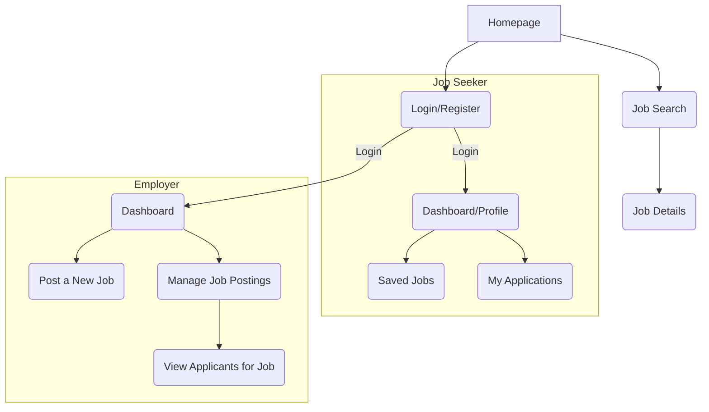

# **Information Architecture (IA)**

**Site Map / Screen Inventory**

This diagram shows the primary screens of the application and their relationships.

**Navigation Structure**

- **Main Navigation (Public/Logged-Out Users):**
  - A primary navigation bar will contain links to: `Jobs`, `For Employers`, `Login`, and a `Register` call-to-action.
- **Main Navigation (Job Seeker):**
  - After logging in, the navigation will change to: `Jobs`, `My Applications`, `Saved Jobs`, and a user menu with a link to their `Profile` and `Logout`.
- **Main Navigation (Employer):**
  - After logging in, the navigation will be: `Dashboard`, `Post a Job`, and a user menu with a link to `Company Profile` and `Logout`.
- **Breadcrumb Strategy:**
  - Breadcrumbs will be used for nested pages to provide context and easy backward navigation. For example: `Dashboard > My Job Postings > Applicants for Software Engineer`.

---

