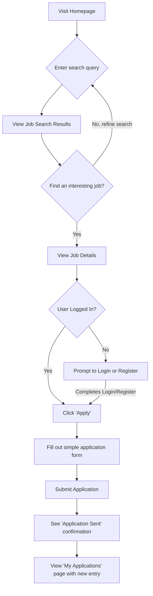
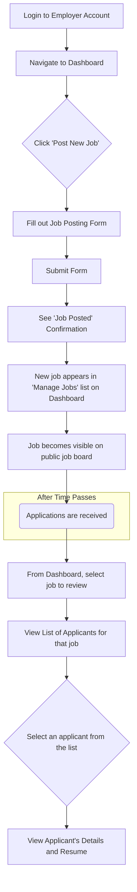

# **User Flows**

**Job Seeker - Find and Apply for a Job**

- **User Goal:** To allow a job seeker to easily find a relevant job and submit their application.
- **Entry Points:** Homepage, direct link to the jobs page.
- **Success Criteria:** The user successfully submits an application, sees a confirmation, and the application appears in their "My Applications" list.

**Flow Diagram**

**Edge Cases & Error Handling:**

- What happens if the user tries to apply for a job they already applied to? (The 'Apply' button should be disabled).
- What happens if a job posting is closed or expires while the user is viewing it? (A clear message should be displayed).
- What happens if there is a network error during application submission? (The system should allow the user to retry without losing their data).
- What happens if the user uploads an invalid file type for their resume? (A clear error message should specify allowed file types).

---

**Employer - Post and Review a Job**

- **User Goal:** To allow an employer to easily post a new job and review the candidates who have applied.
- **Entry Points:** Employer Dashboard.
- **Success Criteria:** The employer successfully posts a job, it appears on the public job board, and they can view the list of candidates who apply.

**Flow Diagram**

**Edge Cases & Error Handling:**

- What happens if the job posting form is submitted with missing required fields? (Clear inline validation errors should appear).
- What happens if an employer tries to post a job that is very similar to one they already have active? (For MVP, we will allow this, but could consider a warning in the future).
- What happens when an employer views a job with zero applicants? (A clear "No applicants yet" message should be displayed).

---

