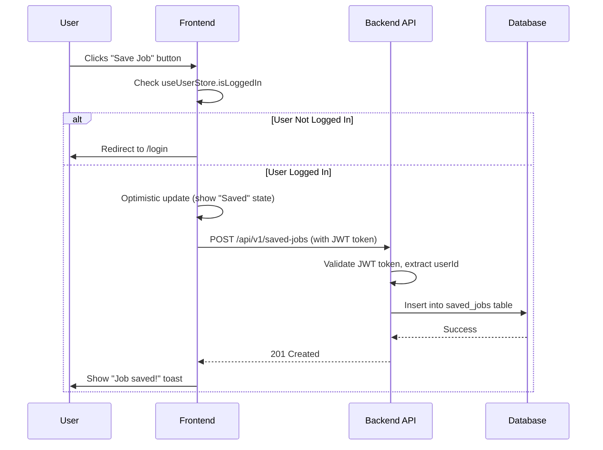

# Story 1.6: Save a Job

**Status**: Draft

**Story**

As a logged-in job seeker,
I want to save a job to a personal list,
so that I can easily find and review it later.

**Acceptance Criteria**

1. When viewing a job's detail page, a logged-in user is shown a "Save Job" button/icon.
2. Clicking "Save Job" adds the job to that user's personal list of saved jobs.
3. The button's appearance changes to indicate the job is saved (e.g., "Saved" or a filled-in icon).
4. A logged-out user does not see the "Save Job" button.
5. The backend provides an authenticated API endpoint to add or remove a job from a user's saved list.

**Tasks / Subtasks**

- [ ] **Task 1: Create Database Schema for Saved Jobs (AC: 2, 5)**
  - [ ] Subtask 1.1: Create `saved_jobs` join table with columns: `user_id` (UUID, FK to users), `job_posting_id` (UUID, FK to job_postings), `saved_at` (TIMESTAMPTZ). [Source: architecture/9-database-schema.md patterns]
  - [ ] Subtask 1.2: Set composite primary key on (`user_id`, `job_posting_id`) to prevent duplicate saves. [Source: Database best practice]
  - [ ] Subtask 1.3: Add foreign key constraints with CASCADE DELETE (if user or job deleted, remove saved record). [Source: architecture/9-database-schema.md patterns]
  - [ ] Subtask 1.4: Create indexes on `user_id` and `job_posting_id` for query performance. [Source: architecture/9-database-schema.md patterns]
  - [ ] Subtask 1.5: Create database migration file for `saved_jobs` table. [Source: Story 1.3 migration patterns]

- [ ] **Task 2: Create Backend SavedJob Entity and Repository (AC: 2, 5)**
  - [ ] Subtask 2.1: Create `SavedJob` entity in `apps/api/src/main/java/com/recruitify/entities/SavedJob.java` with composite key. [Source: architecture/11-backend-architecture.md#data-access-layer-dal]
  - [ ] Subtask 2.2: Use `@IdClass` or `@EmbeddedId` for composite primary key (userId + jobPostingId). [Source: JPA best practice]
  - [ ] Subtask 2.3: Add relationships: `@ManyToOne` to User, `@ManyToOne` to JobPosting. [Source: architecture/4-data-models.md patterns]
  - [ ] Subtask 2.4: Create `SavedJobRepository` extending `JpaRepository<SavedJob, SavedJobId>`. [Source: architecture/11-backend-architecture.md#data-access-layer-dal]
  - [ ] Subtask 2.5: Add custom query method `Optional<SavedJob> findByUserIdAndJobPostingId(UUID userId, UUID jobPostingId)`. [Source: architecture/11-backend-architecture.md#data-access-layer-dal]
  - [ ] Subtask 2.6: Add custom query method `List<SavedJob> findByUserId(UUID userId)` to retrieve all saved jobs for a user. [Source: Future Story 3.2 requirement]
  - [ ] Subtask 2.7: Add custom method `boolean existsByUserIdAndJobPostingId(UUID userId, UUID jobPostingId)` to check if job is saved. [Source: AC 3]

- [ ] **Task 3: Implement Backend SavedJobService (AC: 2, 5)**
  - [ ] Subtask 3.1: Create `SavedJobService` in `apps/api/src/main/java/com/recruitify/service/SavedJobService.java`. [Source: architecture/11-backend-architecture.md#service-architecture]
  - [ ] Subtask 3.2: Implement `saveJob(UUID userId, UUID jobPostingId)` method that creates SavedJob record. [Source: AC 2]
  - [ ] Subtask 3.3: Method should check if job already saved; if yes, return success (idempotent operation). [Source: API best practice]
  - [ ] Subtask 3.4: Verify job exists and is ACTIVE before allowing save. [Source: Business logic]
  - [ ] Subtask 3.5: Implement `unsaveJob(UUID userId, UUID jobPostingId)` method that deletes SavedJob record. [Source: AC 3 - toggle behavior]
  - [ ] Subtask 3.6: Method should be idempotent (no error if job not saved). [Source: API best practice]
  - [ ] Subtask 3.7: Implement `isJobSaved(UUID userId, UUID jobPostingId)` method to check save status. [Source: AC 3]

- [ ] **Task 4: Create Backend SavedJob Controller and API Endpoints (AC: 5)**
  - [ ] Subtask 4.1: Create `SavedJobController` in `apps/api/src/main/java/com/recruitify/controller/SavedJobController.java`. [Source: architecture/11-backend-architecture.md#controllerroute-organization]
  - [ ] Subtask 4.2: Implement `POST /api/v1/saved-jobs` endpoint to save a job. Request body: `{"jobPostingId": "uuid"}`. [Source: architecture/5-api-specification.md patterns]
  - [ ] Subtask 4.3: Endpoint must be **authenticated** - extract userId from JWT token. [Source: architecture/11-backend-architecture.md#authentication-and-authorization]
  - [ ] Subtask 4.4: Return 201 Created on success, 404 Not Found if job doesn't exist. [Source: REST best practice]
  - [ ] Subtask 4.5: Implement `DELETE /api/v1/saved-jobs/{jobPostingId}` endpoint to unsave a job. [Source: architecture/5-api-specification.md patterns]
  - [ ] Subtask 4.6: Endpoint must be **authenticated** - extract userId from JWT token. [Source: architecture/11-backend-architecture.md#authentication-and-authorization]
  - [ ] Subtask 4.7: Return 204 No Content on success. [Source: REST best practice]
  - [ ] Subtask 4.8: Implement `GET /api/v1/saved-jobs/check/{jobPostingId}` endpoint to check if job is saved. [Source: AC 3]
  - [ ] Subtask 4.9: Endpoint must be **authenticated**. Return `{"isSaved": true/false}`. [Source: AC 3]

- [ ] **Task 5: Update User Entity to Track Saved Jobs (AC: 2)**
  - [ ] Subtask 5.1: Add `@OneToMany` relationship in `User` entity to `SavedJob` collection (optional, for future use). [Source: architecture/4-data-models.md#model-user]
  - [ ] Subtask 5.2: Use `mappedBy = "user"` to make relationship bidirectional. [Source: JPA best practice]

- [ ] **Task 6: Create Shared TypeScript Types for Saved Jobs (AC: 2, 5)**
  - [ ] Subtask 6.1: Create `SavedJob` interface in `packages/shared-types/savedJob.ts`. [Source: architecture/17-coding-standards.md#critical-fullstack-rules]
  - [ ] Subtask 6.2: Define interface with fields: `userId`, `jobPostingId`, `savedAt`. [Source: Database schema]
  - [ ] Subtask 6.3: Create `SaveJobRequest` interface for API requests: `{jobPostingId: string}`. [Source: API specification]
  - [ ] Subtask 6.4: Create `SaveJobStatusResponse` interface: `{isSaved: boolean}`. [Source: AC 3]

- [ ] **Task 7: Create Frontend SavedJob Service Layer (AC: 2, 5)**
  - [ ] Subtask 7.1: Create `apps/web/src/services/savedJobService.ts` using centralized apiClient. [Source: architecture/10-frontend-architecture.md#service-example]
  - [ ] Subtask 7.2: Implement `saveJob(jobPostingId: string)` function that calls `POST /api/v1/saved-jobs`. [Source: architecture/10-frontend-architecture.md#api-client-setup]
  - [ ] Subtask 7.3: Implement `unsaveJob(jobPostingId: string)` function that calls `DELETE /api/v1/saved-jobs/{jobPostingId}`. [Source: architecture/10-frontend-architecture.md#api-client-setup]
  - [ ] Subtask 7.4: Implement `checkSaveStatus(jobPostingId: string)` function that calls `GET /api/v1/saved-jobs/check/{jobPostingId}`. [Source: AC 3]
  - [ ] Subtask 7.5: All functions should automatically include auth token via apiClient interceptor. [Source: architecture/10-frontend-architecture.md#api-client-setup]

- [ ] **Task 8: Create Frontend SavedJobs Store (AC: 2, 3)**
  - [ ] Subtask 8.1: Create `useSavedJobsStore.ts` in `apps/web/src/stores/` to manage saved jobs state. [Source: architecture/10-frontend-architecture.md#state-structure]
  - [ ] Subtask 8.2: Store state: `savedJobIds` (Set<string> for fast lookup), `isLoading`, `error`. [Source: architecture/10-frontend-architecture.md#state-management-patterns]
  - [ ] Subtask 8.3: Create action `toggleSaveJob(jobId: string)` that calls saveJob or unsaveJob based on current state. [Source: AC 2, 3]
  - [ ] Subtask 8.4: Create action `checkIfSaved(jobId: string)` that calls savedJobService.checkSaveStatus(). [Source: AC 3]
  - [ ] Subtask 8.5: Create selector `isJobSaved(jobId: string)` that checks if jobId exists in savedJobIds Set. [Source: AC 3]
  - [ ] Subtask 8.6: Update local state immediately (optimistic update) then sync with backend. [Source: UX best practice]

- [ ] **Task 9: Create SaveJobButton Component (AC: 1, 2, 3, 4)**
  - [ ] Subtask 9.1: Create `apps/web/src/features/jobs/SaveJobButton.tsx` component. [Source: architecture/10-frontend-architecture.md#component-organization]
  - [ ] Subtask 9.2: Component accepts `jobId` prop and checks authentication status from `useUserStore`. [Source: AC 4]
  - [ ] Subtask 9.3: If user not logged in, render nothing (null) or hide button. [Source: AC 4]
  - [ ] Subtask 9.4: If user logged in, render button using Ant Design `Button` with heart icon. [Source: architecture/3-tech-stack.md]
  - [ ] Subtask 9.5: Use Ant Design `HeartOutlined` icon for unsaved state, `HeartFilled` icon for saved state. [Source: AC 3 and UX best practice]
  - [ ] Subtask 9.6: On click, call `useSavedJobsStore.toggleSaveJob(jobId)`. [Source: AC 2]
  - [ ] Subtask 9.7: Show loading state while API call in progress. [Source: UX best practice]
  - [ ] Subtask 9.8: Display toast notification on success ("Job saved!" / "Job removed from saved list"). [Source: UX best practice]

- [ ] **Task 10: Integrate SaveJobButton into Job Detail Page (AC: 1)**
  - [ ] Subtask 10.1: Update `apps/web/src/pages/jobs/[jobId].tsx` to include `SaveJobButton` component. [Source: AC 1]
  - [ ] Subtask 10.2: Place button in `JobDetailHeader` component near job title. [Source: UX best practice]
  - [ ] Subtask 10.3: On page mount, check if job is saved using `useSavedJobsStore.checkIfSaved(jobId)`. [Source: AC 3]
  - [ ] Subtask 10.4: Ensure button updates immediately when clicked (optimistic UI). [Source: UX best practice]

- [ ] **Task 11: Handle Authentication Requirements (AC: 4)**
  - [ ] Subtask 11.1: Verify `useUserStore` has user authentication state (token, isLoggedIn). [Source: Story 1.2 - assumed authentication exists]
  - [ ] Subtask 11.2: Update apiClient interceptor to include `Authorization: Bearer {token}` header for authenticated requests. [Source: architecture/11-backend-architecture.md#authorization-filter]
  - [ ] Subtask 11.3: Handle 401 Unauthorized responses by redirecting to login page. [Source: architecture/11-backend-architecture.md#authorization-filter]
  - [ ] Subtask 11.4: Display message to logged-out users when they try to save (redirect to login). [Source: UX best practice]

- [ ] **Task 12: Implement Backend Unit Tests for SavedJob (AC: 2, 5)**
  - [ ] Subtask 12.1: Write unit test for `SavedJobService.saveJob()` to verify it creates SavedJob record. [Source: architecture/16-testing-strategy.md#the-testing-pyramid]
  - [ ] Subtask 12.2: Write unit test for `SavedJobService.saveJob()` with already-saved job (idempotency). [Source: architecture/16-testing-strategy.md#the-testing-pyramid]
  - [ ] Subtask 12.3: Write unit test for `SavedJobService.unsaveJob()` to verify it deletes SavedJob record. [Source: architecture/16-testing-strategy.md#the-testing-pyramid]
  - [ ] Subtask 12.4: Write unit test for `SavedJobService.isJobSaved()` to verify save status check. [Source: architecture/16-testing-strategy.md#the-testing-pyramid]
  - [ ] Subtask 12.5: Write unit test to verify saving non-existent job returns error. [Source: architecture/16-testing-strategy.md#the-testing-pyramid]
  - [ ] Subtask 12.6: Place tests in `apps/api/src/test/java/com/recruitify/service/SavedJobServiceTest.java`. [Source: architecture/16-testing-strategy.md#test-organization]

- [ ] **Task 13: Implement Backend Integration Tests for SavedJob API (AC: 5)**
  - [ ] Subtask 13.1: Write integration test for `POST /api/v1/saved-jobs` with valid auth token and jobId. [Source: architecture/16-testing-strategy.md#the-testing-pyramid]
  - [ ] Subtask 13.2: Write integration test for `POST /api/v1/saved-jobs` without auth token (expect 401). [Source: architecture/16-testing-strategy.md#the-testing-pyramid]
  - [ ] Subtask 13.3: Write integration test for `DELETE /api/v1/saved-jobs/{jobId}` with valid auth token. [Source: architecture/16-testing-strategy.md#the-testing-pyramid]
  - [ ] Subtask 13.4: Write integration test for `GET /api/v1/saved-jobs/check/{jobId}` to verify save status check. [Source: architecture/16-testing-strategy.md#the-testing-pyramid]
  - [ ] Subtask 13.5: Verify all endpoints require authentication (401 without token). [Source: AC 5]
  - [ ] Subtask 13.6: Place tests in `apps/api/src/test/java/com/recruitify/controller/SavedJobControllerIntegrationTest.java`. [Source: architecture/16-testing-strategy.md#test-organization]

- [ ] **Task 14: Implement Frontend Component Tests for SaveJobButton (AC: 1, 3, 4)**
  - [ ] Subtask 14.1: Write unit test for `SaveJobButton` to verify it doesn't render when user not logged in. [Source: architecture/16-testing-strategy.md#frontend-component-test-example-jest-rtl]
  - [ ] Subtask 14.2: Write unit test for `SaveJobButton` to verify it renders with unsaved icon when job not saved. [Source: architecture/16-testing-strategy.md#frontend-component-test-example-jest-rtl]
  - [ ] Subtask 14.3: Write unit test for `SaveJobButton` to verify it renders with saved icon when job is saved. [Source: architecture/16-testing-strategy.md#frontend-component-test-example-jest-rtl]
  - [ ] Subtask 14.4: Write unit test to verify clicking button calls toggleSaveJob action. [Source: architecture/16-testing-strategy.md#frontend-component-test-example-jest-rtl]
  - [ ] Subtask 14.5: Place tests in `apps/web/src/features/jobs/SaveJobButton.test.tsx`. [Source: architecture/16-testing-strategy.md#test-organization]

- [ ] **Task 15: Implement E2E Tests for Save Job Flow (AC: 1, 2, 3, 4, 5)**
  - [ ] Subtask 15.1: Create Playwright E2E test for logged-out user: verify Save button is hidden on job detail page. [Source: architecture/16-testing-strategy.md#the-testing-pyramid]
  - [ ] Subtask 15.2: Create E2E test for logged-in user: navigate to job detail page and verify Save button is visible. [Source: AC 1]
  - [ ] Subtask 15.3: Test clicking Save button and verify button changes to "Saved" state. [Source: AC 3]
  - [ ] Subtask 15.4: Test clicking Save button again (unsave) and verify button returns to unsaved state. [Source: AC 3]
  - [ ] Subtask 15.5: Test page refresh maintains saved state (verify API check on mount). [Source: AC 3]
  - [ ] Subtask 15.6: Test authentication flow: logged-out user clicks prompt, redirects to login, returns to job with save functionality. [Source: AC 4]
  - [ ] Subtask 15.7: Place tests in `e2e/save-job.spec.ts`. [Source: architecture/16-testing-strategy.md#test-organization]

**Dev Notes**

**Previous Story Insights**:

Stories 1.3-1.5 established the job browsing experience for unauthenticated users:
- **Story 1.3**: Created `JobPosting` entity, `GET /api/v1/jobs` public endpoint, job listing UI
- **Story 1.4**: Added search/filter functionality (keyword, location, category)
- **Story 1.5**: Added job detail page with full description view

**Story 1.2** (assumed complete) established user registration and authentication:
- User can register and login
- JWT-based authentication
- `User` entity with roles (JOB_SEEKER, RECRUITER)
- Frontend has `useUserStore` for managing auth state

**This story introduces:**
- **First authenticated endpoint** requiring JWT token
- **Many-to-many relationship** between Users and JobPostings (via saved_jobs join table)
- **Optimistic UI updates** for better perceived performance
- **Conditional rendering** based on authentication status

**Critical Architectural Gap**: The architecture documents mention authentication with JWT and Spring Security (architecture/11-backend-architecture.md) but do not provide complete implementation details for extracting user ID from JWT in controllers. The Dev Agent should follow the established pattern from Story 1.2 authentication implementation.

**Data Models**:

*   **SavedJob Entity (NEW)**:
    *   Composite Primary Key: (`userId`, `jobPostingId`)
    *   `userId`: `string` (UUID, FK to User)
    *   `jobPostingId`: `string` (UUID, FK to JobPosting)
    *   `savedAt`: `Date` - Timestamp when job was saved
    *   [Source: Inferred from AC 2, 5 and architecture/9-database-schema.md patterns]

*   **User Entity (from Story 1.2, extended)**:
    *   Existing fields: `id`, `email`, `passwordHash`, `role`, `createdAt`, `updatedAt`
    *   **NEW relationship**: `@OneToMany savedJobs` collection
    *   [Source: architecture/4-data-models.md#model-user]

*   **JobPosting Entity (from Story 1.3, no changes)**:
    *   All existing fields remain the same
    *   Many-to-many relationship with User via SavedJob join entity
    *   [Source: Story 1.3 Dev Notes]

**Database Schema**:

```sql
-- Saved jobs join table (many-to-many relationship)
CREATE TABLE saved_jobs (
    user_id UUID NOT NULL REFERENCES users(id) ON DELETE CASCADE,
    job_posting_id UUID NOT NULL REFERENCES job_postings(id) ON DELETE CASCADE,
    saved_at TIMESTAMPTZ NOT NULL DEFAULT NOW(),
    PRIMARY KEY (user_id, job_posting_id)
);

-- Indexes for performance
CREATE INDEX idx_saved_jobs_user_id ON saved_jobs (user_id);
CREATE INDEX idx_saved_jobs_job_posting_id ON saved_jobs (job_posting_id);
```

**Why composite primary key?**
- Prevents duplicate saves (user can't save same job twice)
- Natural key that represents the relationship
- Efficient for lookups and prevents data inconsistency

[Source: architecture/9-database-schema.md patterns and database best practice]

**TypeScript Interfaces**:

```typescript
// In packages/shared-types/savedJob.ts (NEW)

export interface SavedJob {
  userId: string;
  jobPostingId: string;
  savedAt: Date;
}

export interface SaveJobRequest {
  jobPostingId: string;
}

export interface SaveJobStatusResponse {
  isSaved: boolean;
}
```

[Source: architecture/17-coding-standards.md#critical-fullstack-rules]

**API Specifications**:

All endpoints require authentication via JWT token in `Authorization: Bearer {token}` header.

*   **POST /api/v1/saved-jobs**: Save a job to user's list
    *   **Request Body**: `{"jobPostingId": "uuid"}`
    *   **Authentication**: Required (JWT token)
    *   **Response**:
        *   **201 Created**: Job saved successfully
        *   **401 Unauthorized**: No auth token or invalid token
        *   **404 Not Found**: Job doesn't exist or is not ACTIVE
    *   **Idempotency**: Calling twice with same jobId returns success (no error)

*   **DELETE /api/v1/saved-jobs/{jobPostingId}**: Remove job from user's saved list
    *   **Path Parameters**: `jobPostingId` (UUID)
    *   **Authentication**: Required (JWT token)
    *   **Response**:
        *   **204 No Content**: Job removed successfully
        *   **401 Unauthorized**: No auth token or invalid token
    *   **Idempotency**: Calling on unsaved job returns success (no error)

*   **GET /api/v1/saved-jobs/check/{jobPostingId}**: Check if job is saved
    *   **Path Parameters**: `jobPostingId` (UUID)
    *   **Authentication**: Required (JWT token)
    *   **Response**:
        *   **200 OK**: `{"isSaved": true}` or `{"isSaved": false}`
        *   **401 Unauthorized**: No auth token or invalid token

[Source: architecture/5-api-specification.md patterns and AC 5]

**Authentication Flow**:



[Source: architecture/11-backend-architecture.md#authentication-flow and AC 4]

**JPA Composite Key Implementation**:

Two approaches for composite keys in JPA:

**Option 1: @IdClass** (Simpler)
```java
@Entity
@IdClass(SavedJobId.class)
public class SavedJob {
    @Id
    private UUID userId;

    @Id
    private UUID jobPostingId;

    private LocalDateTime savedAt;

    @ManyToOne
    @JoinColumn(name = "user_id", insertable = false, updatable = false)
    private User user;

    @ManyToOne
    @JoinColumn(name = "job_posting_id", insertable = false, updatable = false)
    private JobPosting jobPosting;
}

// Separate ID class
public class SavedJobId implements Serializable {
    private UUID userId;
    private UUID jobPostingId;
    // equals() and hashCode() required
}
```

**Option 2: @EmbeddedId** (More OOP)
```java
@Entity
public class SavedJob {
    @EmbeddedId
    private SavedJobId id;

    private LocalDateTime savedAt;

    @ManyToOne
    @MapsId("userId")
    private User user;

    @ManyToOne
    @MapsId("jobPostingId")
    private JobPosting jobPosting;
}

@Embeddable
public class SavedJobId implements Serializable {
    private UUID userId;
    private UUID jobPostingId;
    // equals() and hashCode() required
}
```

Either approach works. **Recommendation**: Use @IdClass for simpler code.

[Source: JPA best practice and Spring Data JPA documentation]

**Component Architecture**:

```
SaveJobButton.tsx (NEW)
  ├── Props: { jobId: string }
  ├── Checks: useUserStore.isLoggedIn
  ├── State: useSavedJobsStore.isJobSaved(jobId)
  └── Action: useSavedJobsStore.toggleSaveJob(jobId)

JobDetailHeader.tsx (MODIFIED)
  ├── Existing: Job title, company, location
  └── NEW: <SaveJobButton jobId={jobId} />
```

*   **SaveJobButton**: Self-contained component handling authentication check, save state, and toggle logic
*   **Icon States**:
    *   Unsaved: `<HeartOutlined />` (outline heart icon)
    *   Saved: `<HeartFilled />` (filled heart icon)
    *   Loading: Show spinner on button
*   **Placement**: In job detail header, typically right-aligned near job title

[Source: architecture/10-frontend-architecture.md#component-organization and UX best practice]

**State Management - Optimistic Updates**:

```typescript
// In useSavedJobsStore.ts
toggleSaveJob: async (jobId: string) => {
  const { savedJobIds } = get();
  const isSaved = savedJobIds.has(jobId);

  // 1. Optimistic update (immediate UI feedback)
  if (isSaved) {
    set({ savedJobIds: new Set([...savedJobIds].filter(id => id !== jobId)) });
  } else {
    set({ savedJobIds: new Set([...savedJobIds, jobId]) });
  }

  try {
    // 2. Sync with backend
    if (isSaved) {
      await savedJobService.unsaveJob(jobId);
    } else {
      await savedJobService.saveJob(jobId);
    }
  } catch (error) {
    // 3. Rollback on error
    if (isSaved) {
      set({ savedJobIds: new Set([...savedJobIds, jobId]) });
    } else {
      set({ savedJobIds: new Set([...savedJobIds].filter(id => id !== jobId)) });
    }
    throw error;
  }
}
```

**Why optimistic updates?**
- Instant visual feedback (feels faster)
- Better perceived performance
- Rollback on error maintains data consistency

[Source: architecture/10-frontend-architecture.md#state-management-patterns and UX best practice]

**File Locations**:

*   **Backend**:
    *   Entity: `apps/api/src/main/java/com/recruitify/entities/SavedJob.java` (new)
    *   Entity: `apps/api/src/main/java/com/recruitify/entities/SavedJobId.java` (new, composite key)
    *   Repository: `apps/api/src/main/java/com/recruitify/repository/SavedJobRepository.java` (new)
    *   Service: `apps/api/src/main/java/com/recruitify/service/SavedJobService.java` (new)
    *   Controller: `apps/api/src/main/java/com/recruitify/controller/SavedJobController.java` (new)
    *   Migration: `apps/api/src/main/resources/db/migration/V{n}__create_saved_jobs_table.sql` (new)
    *   Tests: `apps/api/src/test/java/com/recruitify/service/SavedJobServiceTest.java`, `apps/api/src/test/java/com/recruitify/controller/SavedJobControllerIntegrationTest.java` (new)

*   **Frontend**:
    *   Shared Types: `packages/shared-types/savedJob.ts` (new)
    *   Service: `apps/web/src/services/savedJobService.ts` (new)
    *   Store: `apps/web/src/stores/useSavedJobsStore.ts` (new)
    *   Component: `apps/web/src/features/jobs/SaveJobButton.tsx` (new)
    *   Page: `apps/web/src/pages/jobs/[jobId].tsx` (modify to add SaveJobButton)
    *   Component: `apps/web/src/features/jobs/JobDetailHeader.tsx` (modify to include SaveJobButton)
    *   Tests: `apps/web/src/features/jobs/SaveJobButton.test.tsx` (new)

*   **E2E**: `e2e/save-job.spec.ts` (new)

[Source: architecture/12-unified-project-structure.md#project-directory-structure]

**Security Considerations**:

*   **Authentication Required**: All save/unsave endpoints MUST require valid JWT token. [Source: AC 5]
*   **User Isolation**: Users can only save jobs to their own list. Extract userId from JWT token, NOT from request body. [Source: Security best practice]
*   **Authorization**: Use Spring Security `@PreAuthorize("hasRole('JOB_SEEKER')")` to restrict to job seekers only. [Source: architecture/11-backend-architecture.md#authorization-filter]
*   **Job Validation**: Verify job exists and is ACTIVE before allowing save. [Source: Business logic]
*   **CSRF Protection**: POST/DELETE endpoints should have CSRF protection enabled. [Source: architecture/15-security-and-performance.md]

**Error Handling**:

*   **401 Unauthorized**: Redirect to login page, show message "Please log in to save jobs". [Source: UX best practice]
*   **404 Not Found**: Show toast "This job is no longer available". [Source: UX best practice]
*   **Network Errors**: Rollback optimistic update, show toast "Failed to save job. Please try again." [Source: architecture/18-error-handling-strategy.md]
*   **Token Expiration**: Detect 401 response, clear user session, redirect to login. [Source: architecture/11-backend-architecture.md#authorization-filter]

**Performance Considerations**:

*   **Fast Lookups**: Use `Set<string>` for savedJobIds in frontend store for O(1) lookup time. [Source: Performance best practice]
*   **Database Indexes**: Index both user_id and job_posting_id for fast queries. [Source: architecture/9-database-schema.md patterns]
*   **Composite Primary Key**: Prevents duplicate saves at database level, no application-level check needed. [Source: Database best practice]
*   **Optimistic Updates**: UI responds instantly, backend sync happens asynchronously. [Source: UX best practice]

**Future Story Dependencies**:

This story lays the foundation for **Story 3.2: Job Seeker "Saved Jobs" Page**, which will:
- Display all saved jobs for a user
- Use the `SavedJobRepository.findByUserId()` method created in this story
- Reuse the `SaveJobButton` component for unsaving from the list

[Source: Epic 1 story list]

**Naming Conventions**:

*   React components: `PascalCase` (e.g., `SaveJobButton.tsx`) [Source: architecture/17-coding-standards.md#naming-conventions]
*   React hooks: `useCamelCase` (e.g., `useSavedJobsStore.ts`) [Source: architecture/17-coding-standards.md#naming-conventions]
*   Java classes: `PascalCase` (e.g., `SavedJobService.java`, `SavedJobId.java`) [Source: architecture/17-coding-standards.md#naming-conventions]
*   API endpoints: `kebab-case` (e.g., `/api/v1/saved-jobs`) [Source: architecture/17-coding-standards.md#naming-conventions]
*   Database tables: `snake_case` (e.g., `saved_jobs`) [Source: architecture/17-coding-standards.md#naming-conventions]

**Testing**

**Unit Tests:**
*   **Backend**: Use JUnit 5 & Mockito. Test service methods for save, unsave, check status, idempotency. [Source: architecture/16-testing-strategy.md#the-testing-pyramid]
*   **Frontend**: Use Jest & React Testing Library. Test SaveJobButton renders correctly based on auth and save state. [Source: architecture/16-testing-strategy.md#frontend-component-test-example-jest-rtl]

**Integration Tests:**
*   Backend controller-service-repository tests to verify full API request/response cycle with JWT authentication. Test 401 responses for missing/invalid tokens. [Source: architecture/16-testing-strategy.md#the-testing-pyramid]

**E2E Tests:**
*   Use Playwright to test complete user journey: Login → Navigate to job detail → Save job → Verify saved state → Unsave job → Verify unsaved state. Test logged-out user doesn't see button. [Source: architecture/16-testing-strategy.md#the-testing-pyramid]

**Test Coverage Requirements:**
*   Test save job (authenticated)
*   Test unsave job (authenticated)
*   Test save status check (authenticated)
*   Test all endpoints return 401 without auth token
*   Test idempotency (saving already-saved job, unsaving already-unsaved job)
*   Test button hidden for logged-out users
*   Test button state changes (outline → filled → outline)
*   Test optimistic updates and rollback on error
*   Tests should be placed according to the testing strategy: backend tests in `src/test/java`, frontend tests co-located, E2E tests in `e2e/` directory. [Source: architecture/16-testing-strategy.md#test-organization]

**Change Log**

| Date | Version | Description | Author |
| :--- | :--- | :--- | :--- |
| 2025-11-06 | 1.0 | Initial draft based on Epic 1, Story 1.6 | Bob (SM) |

**Dev Agent Record**

**Agent Model Used**
{{agent_model_name_version}}

**Debug Log References**

**Completion Notes List**

**File List**

**QA Results**
